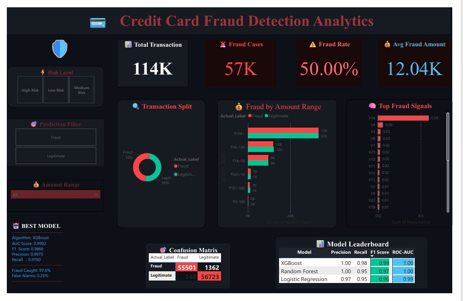

# 💳 Credit Card Fraud Detection & Analytics System


> End-to-end machine learning system detecting fraudulent credit card 
> transactions with **99.92% AUC** and an interactive Power BI dashboard.

---

## 📌 Problem Statement

Credit card fraud costs the global economy billions annually. 
This project builds a production-ready ML pipeline that:

- Detects **97.6% of all fraud** with only 0.25% false alarms
- Handles real-world class imbalance using **SMOTE**
- Identifies **V14 as the dominant fraud signal** (59% importance)
- Visualizes patterns through a **7-visual Power BI dashboard**

---

## 🖥️ Dashboard Preview



---

## 📊 Model Performance

| Model | Precision | Recall | F1 Score | ROC-AUC |
|-------|-----------|--------|----------|---------|
| ⭐ XGBoost | 0.9975 | 0.9760 | 0.9866 | **0.9992** |
| Random Forest | 0.9987 | 0.9511 | 0.9743 | 0.9988 |
| Logistic Regression | 0.9749 | 0.9532 | 0.9639 | 0.9930 |

---

## 🎯 Business Impact

| Metric | Value |
|--------|-------|
| Total Transactions Analyzed | 113,726 |
| Fraud Cases Detected | 55,501 (97.6%) |
| Fraud Cases Missed | 1,362 |
| False Alarms | 140 (0.25%) |
| Dominant Fraud Signal | V14 (59.3% importance) |

---

## 🗂️ Project Structure
```
credit-card-fraud-detection/
├── data/
│   ├── creditcard_2023.csv
│   ├── dashboard_export.csv
│   ├── feature_importance.csv
│   └── model_results.csv
├── notebooks/
│   ├── 01_data_exploration.ipynb
│   ├── 02_preprocessing.ipynb
│   └── 03_model_training.ipynb
├── models/
│   ├── fraud_model.pkl
│   └── scaler.pkl
├── dashboard/
│   └── fraud_dashboard.pbix
└── README.md
```

---

## ⚙️ Tech Stack

| Category | Tools |
|----------|-------|
| Language | Python 3.11 |
| ML Models | XGBoost, Random Forest, Logistic Regression |
| Imbalance | SMOTE (imbalanced-learn) |
| Processing | Pandas, NumPy, Scikit-learn |
| Visualization | Matplotlib, Seaborn, Power BI |
| Model Saving | Joblib |

---

## 🚀 Quick Start
```bash
# Clone
git clone https://github.com/Amanyadav-07/credit-card-fraud-detection

# Install
pip install pandas numpy scikit-learn xgboost imbalanced-learn \
            matplotlib seaborn joblib

# Run notebooks in order
jupyter notebook notebooks/01_data_exploration.ipynb
```

---

## 🔍 Key Findings

1. **V14 dominates** fraud detection at 59.3% feature importance
2. **Amount is not a fraud signal** — fraud occurs at all price ranges
3. **9 features explain 80%** of all predictive power
4. **XGBoost beats Random Forest** on recall — critical for fraud

---

## ❓ Interview Q&A

**Why not accuracy?**
A model predicting everything as legitimate scores 50% accuracy 
but catches zero fraud. Recall measures what % of real fraud 
we actually caught — that is the business metric that matters.

**What is SMOTE?**
Synthetic Minority Oversampling Technique creates new fraud 
samples by interpolating between existing ones. We simulated 
1% real-world fraud rate then applied SMOTE to balance training.

**Why XGBoost?**
Gradient boosting iteratively corrects misclassifications. 
It handles non-linear patterns in PCA features better than 
linear models and is the industry standard for tabular fraud data.

**What does V14 represent?**
V14 is an anonymized PCA component contributing 59% of 
predictive gain — likely encoding transaction velocity, 
merchant behavior, or geographic anomaly patterns.
